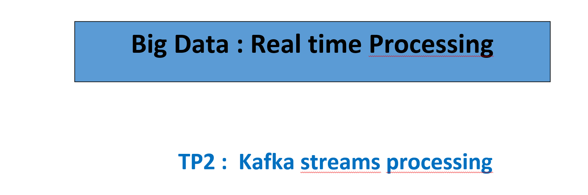
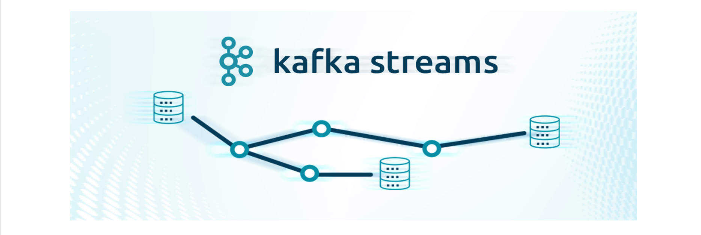
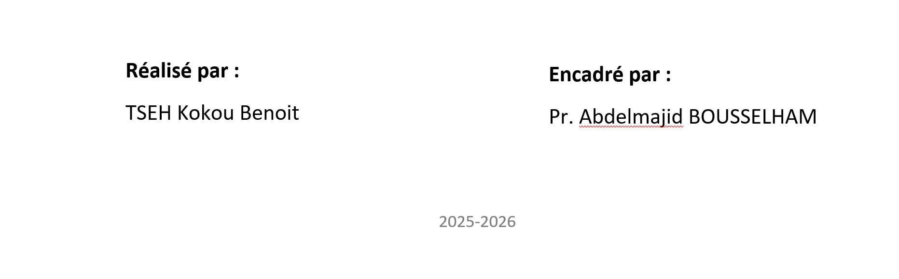

#                   Analyse de Flux de Données avec Kafka Streams
## INTRODUCTION 

Cet exercice pratique s'inscrit dans le cadre de l'analyse et de la transformation de données en temps réel, un pilier fondamental du Big Data Processing moderne. Nous allons utiliser Apache Kafka Streams, une librairie cliente pour Kafka, afin de développer une application légère et tolérante aux pannes, capable de traiter des flux de messages de manière continue.

L'objectif principal est de mettre en œuvre un pipeline de traitement de données textuelles. Ce pipeline consistera à lire des messages bruts d'un topic source, à y appliquer une série d'opérations de nettoyage (normalisation) et de filtrage (validation des règles métier), avant de les distribuer.

Nous appliquerons la notion de routage conditionnel pour garantir la qualité du flux de sortie :
-  Les messages conformes seront acheminés vers le topic de données propres (text-clean).

- Les messages non conformes (invalides, mal formés ou contenant du contenu illicite) seront isolés dans un Dead-Letter Topic (DLT) (text-dead-letter) pour une inspection ou un traitement ultérieur.

Ce travail permet de maîtriser les concepts essentiels de la gestion des flux d'événements (Event Stream Processing) et de l'implémentation de la logique métier directement dans le flux de données.

## Préparationde l'espace de travail

On  dispose d'un fichier [**dockerp-compose.yml**](./docker-compose.yml) contenant  un service broker kafka avec ces dépendance nécéssaire :


```yml

services:
 broker:
  image: apache/kafka:latest
  container_name: brokerkafka
  ports:
   - "9092:9092"
  environment:
   KAFKA_NODE_ID: 1
   KAFKA_PROCESS_ROLES: broker,controller
  # Écoute sur toutes interfaces dans le conteneur
   KAFKA_LISTENERS: PLAINTEXT://:9092,CONTROLLER://:9093
  #  Annonce aux clients Windows : localhost:9092
   KAFKA_ADVERTISED_LISTENERS: PLAINTEXT://localhost:9092
   KAFKA_LISTENER_SECURITY_PROTOCOL_MAP: CONTROLLER:PLAINTEXT,PLAINTEXT:PLAINTEXT
   KAFKA_CONTROLLER_LISTENER_NAMES: CONTROLLER
   KAFKA_CONTROLLER_QUORUM_VOTERS: 1@broker:9093
   KAFKA_OFFSETS_TOPIC_REPLICATION_FACTOR: 1
   KAFKA_TRANSACTION_STATE_LOG_REPLICATION_FACTOR: 1
   KAFKA_TRANSACTION_STATE_LOG_MIN_ISR: 1
   KAFKA_GROUP_INITIAL_REBALANCE_DELAY_MS: 0
   KAFKA_NUM_PARTITIONS: 3

```

Avec la commande :

```Bash
 docker-compose up -d
  ```

on exécute  l'image pour avoir le conteneur.
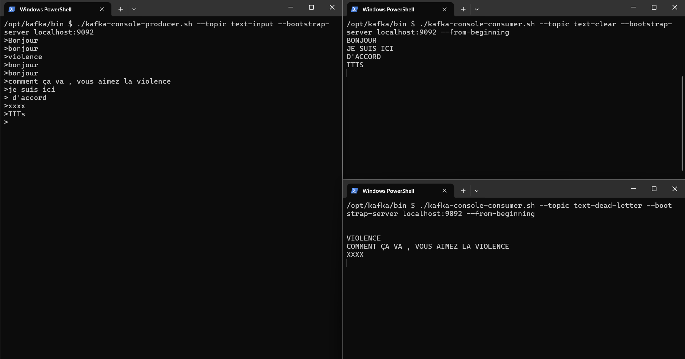


## Tâches à réaliser


### 1. Créer les topics suivants :

Pour pouvoir créer les topis , nous allons exécuter acceder au terminall du conteneur et l 'executer specialement dans le repetoir */opt/kafka/bin/* via la commande :

```Bash
docker exec --workdir /opt/kafka/bin/ -it brokerkafka sh
```


une fois dans le repertoire nous pouvos proceder à la création des  des topics :

- **text-input**

```Bash
./kafka-topics.sh --create --topic text-input --bootstrap-server localhost:9092 --partitions 1 --replication-factor 1
```
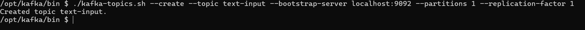

- **text-clean**
```Bash
./kafka-topics.sh --create --topic text-clear --bootstrap-server localhost:9092 --partitions 1 --replication-factor 1

```
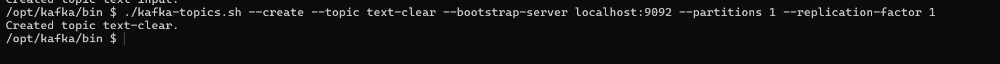

- **text-dead-letter**
```Bash
./kafka-topics.sh --create --topic text-dead-letter --bootstrap-server localhost:9092 --partitions 1 --replication-factor 1
```
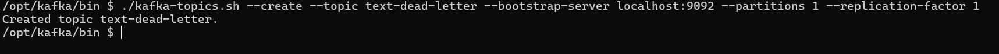


pour la suite des question on crée une application java  21  avec  une dependance  kafka Stream :

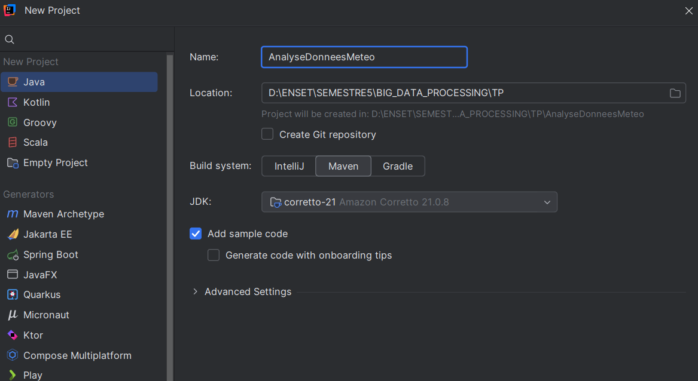

```XML
 <dependencies>
        <dependency>
            <groupId>org.apache.kafka</groupId>
            <artifactId>kafka-streams</artifactId>
            <version>3.9.1</version>
        </dependency>
    </dependencies>
```
Et On developpent l 'application
Le code source se trouve dans le projet [lien vers le code source](./AnalyseMeteo/src/main/java/enset/ma/App1.java)
 
### 2. Lire les messages du topic text-input Chaque message est une simple chaîne de caractères.

### 3. Effectuer les traitements suivants :
• Supprimer les espaces avant/après (trim)
• Remplacer les espaces multiples par un seul espace
• Convertir la chaîne en majuscules
### 4. Filtrer les messages selon les règles suivantes :
• Rejeter les messages vides ou constitués uniquement d’espaces
• Rejeter les messages contenant certains mots interdits (ex. : HACK, SPAM,
XXX)
• Rejeter les messages dépassant une longueur de 100 caractères
### 5. Routage :

• Les messages valides (après filtrage + nettoyage) sont envoyés dans le topic text-
clean

• Les messages invalides sont envoyés tels quels dans le topic text-dead-letter

Après developpement de tous ces étapes ont fait on executer l'application :

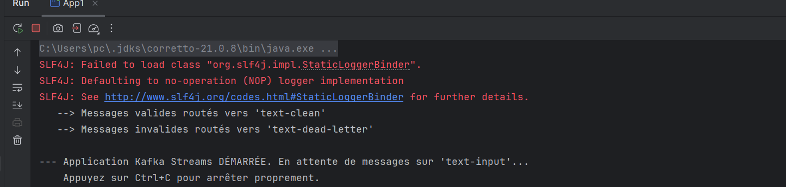
Nous passons alors au test 

6. Tester :

• Envoyer plusieurs messages (valides / invalides) dans text-input :


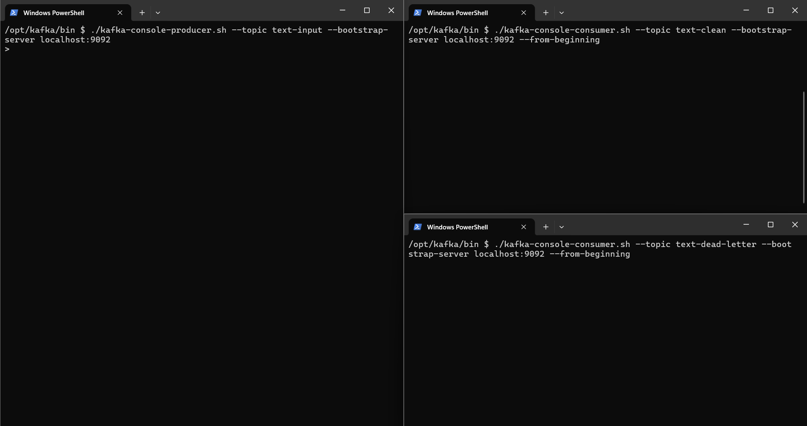


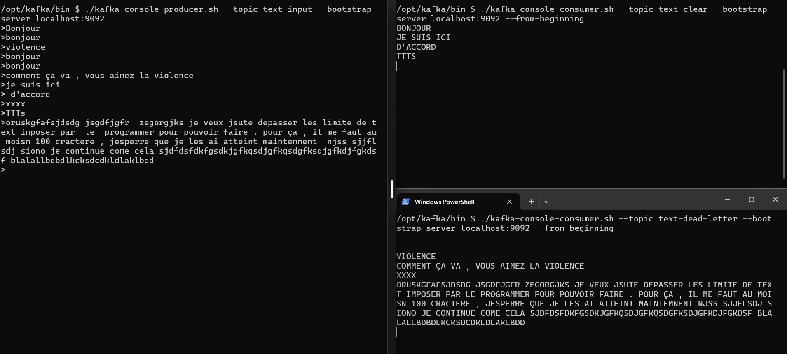


## CONCLUSION 

Cet exercice a permis de concrétiser la mise en place d'un pipeline de traitement de flux robuste et résilient en utilisant Apache Kafka Streams.

Nous avons démontré la capacité de Kafka Streams à gérer efficacement le cycle de vie des données, depuis leur ingestion jusqu'à leur destination finale, en passant par des étapes cruciales de validation et de transformation.

Points Clés Réalisés :

   - Normalisation et Qualité des Données : Par l'application de fonctions trim, de remplacement des espaces et de conversion en majuscules, nous avons assuré l'uniformité du format des données pour faciliter les traitements ultérieurs.
   - Fiabilité et Routage Conditionnel : La mise en œuvre réussie du filtrage (taille, contenu, et validité) est fondamentale. Plus important encore, le routage vers le Dead-Letter Topic (DLT) (text-dead-letter) a établi une stratégie de gestion des erreurs claire. Cela permet d'isoler les données problématiques sans interrompre le flux principal des données valides, garantissant ainsi la résilience de l'application.

   - Maîtrise de l'API Streams : L'exercice a validé la compréhension des concepts de base de Kafka Streams (KStream, filter, map, to), essentiels pour le développement d'applications de Big Data Processing réactives et distribuées.

En définitive, cette implémentation illustre parfaitement comment Kafka Streams peut servir d'épine dorsale pour des architectures de microservices pilotées par les événements, où la logique métier de nettoyage et de validation est intégrée directement au sein du flux de données.


